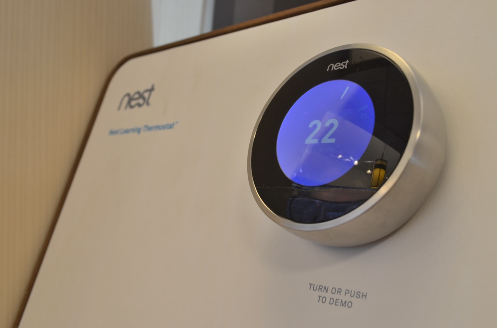
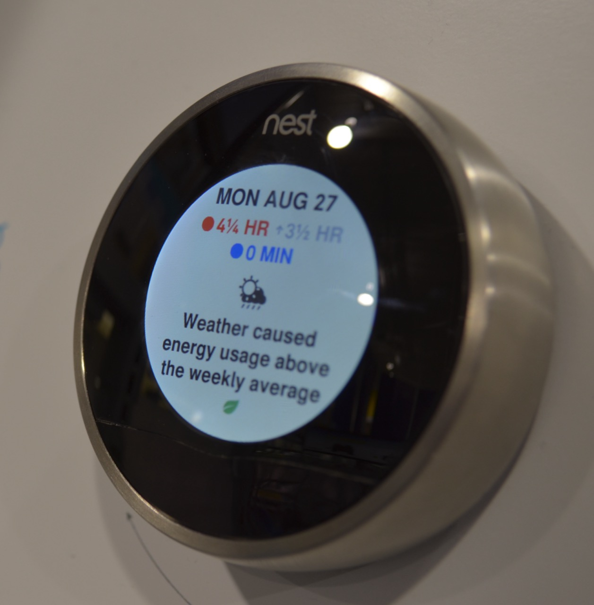
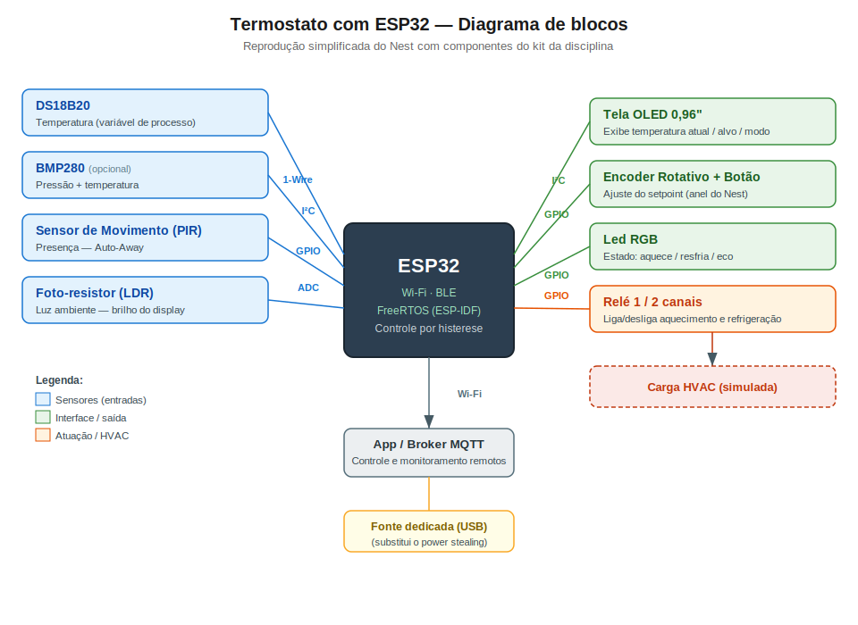

# Estudo Teórico-Exploratório: Nest Learning Thermostat

> **Trabalho 2 — Fundamentos de Sistemas Embarcados (FGA-UnB) — 2026/1**
> Estudo teórico-exploratório de um termostato inteligente e proposta de reprodução conceitual com ESP32.

## Identificação

| Nome completo | Matrícula |
| --- | --- |
| Gustavo Alves de Souza | 211063111 |
| Yasmim Oliveira Rosa | 200029088 |

---

## Sumário

1. [Descrição do produto selecionado](#1-descrição-do-produto-selecionado)
2. [Análise técnica do funcionamento](#2-análise-técnica-do-funcionamento)
3. [Proposta de reprodução com ESP32](#3-proposta-de-reprodução-com-esp32)
4. [Pesquisa bibliográfica e tecnológica](#4-pesquisa-bibliográfica-e-tecnológica)
5. [Comparativo com produtos similares](#5-comparativo-com-produtos-similares)
6. [Referências bibliográficas](#6-referências-bibliográficas)

---

## 1. Descrição do produto selecionado

O **Nest Learning Thermostat** é um termostato inteligente lançado pela **Nest Labs** em 2011 (empresa fundada por Tony Fadell e Matt Rogers, ex-Apple) e adquirida pela **Google** em 2014. É um dos produtos pioneiros e mais emblemáticos da categoria de automação residencial conectada (*smart home*).

> *Nest Learning Thermostat com o anel rotativo de aço inox e o display circular indicando a temperatura-alvo (22 °C). O texto "TURN OR PUSH TO DEMO" evidencia a interface por giro/clique do anel. Fonte: [Wikimedia Commons, NestLearningThermostat3.JPG](https://commons.wikimedia.org/wiki/File:NestLearningThermostat3.JPG) — domínio público (CC0).*

### Funções principais

- **Aprendizado de hábitos (*Learning*):** nas primeiras semanas registra os ajustes manuais do usuário e cria automaticamente uma programação de temperatura.
- **Auto-Away:** usa sensores de presença para detectar ausência e reduzir o consumo de climatização.
- **Controle remoto:** ajuste e monitoramento via aplicativo (smartphone/web) por conexão Wi-Fi.
- **Relatórios de energia / Nest Leaf:** indica ao usuário quando uma temperatura escolhida é eficiente, incentivando economia.
- **Controle de sistemas HVAC** (aquecimento, ventilação e ar-condicionado) residenciais.

> *Tela de feedback de energia do Nest ("Weather caused energy usage above the weekly average"), com o ícone da folha (**Nest Leaf**) que sinaliza ao usuário escolhas eficientes. Fonte: [Wikimedia Commons, Nest Learning Thermostat (cropped).JPG](https://commons.wikimedia.org/wiki/File:Nest_Learning_Thermostat_(cropped).JPG) — domínio público (CC0).*

### Público-alvo e contexto de uso

Consumidores residenciais em regiões com sistemas de HVAC (forte presença em EUA/Europa), interessados em conforto térmico automatizado e redução de consumo energético. Contexto de uso: substituição do termostato de parede tradicional, integrando-se ao ecossistema de casa conectada (Google Home, e historicamente Works with Nest).

### Componentes e sensores utilizados

- Sensor(es) de **temperatura**;
- Sensor de **umidade**;
- Sensores de **presença/ocupação** (PIR — *near-field* e *far-field*);
- Sensor de **luminosidade ambiente** (ajuste de brilho do display e ativação ao se aproximar);
- **Display circular** colorido (LCD/TFT);
- **Anel rotativo** com clique como interface de entrada;
- **Bateria recarregável** de íon-lítio + circuito de *power stealing* (captação de energia da fiação do HVAC).

> As especificações detalhadas de cada componente, com os respectivos números de peça por geração, estão documentadas na [Seção 2](#2-análise-técnica-do-funcionamento) e fundamentadas nos *teardowns* e nas especificações oficiais listados nas [Referências](#6-referências-bibliográficas).

### Tecnologias de comunicação e controle embarcadas

- **Wi-Fi** 802.11 b/g/n (2,4 GHz) para conexão com a nuvem/app;
- **IEEE 802.15.4** (ZigBee / posteriormente Thread) para malha de baixo consumo;
- **Bluetooth LE** (gerações mais recentes, usado no setup);
- Controle dos circuitos de **24 VAC** do HVAC através de relés/chaveamento (terminais W, Y, G, Rh/Rc, etc.).

---

## 2. Análise técnica do funcionamento

### Principais módulos do sistema

| Módulo | Função no Nest |
| --- | --- |
| **Sensores** | Temperatura, umidade, presença (PIR *near*/*far-field*), luz ambiente |
| **Atuadores** | Relés/chaves de estado sólido que comandam os sinais 24 VAC do HVAC; display TFT |
| **Controle** | SoC de aplicação (ARM, Linux) + microcontrolador de baixo consumo dedicado ao chaveamento do HVAC e ao *power stealing* |
| **Interface** | Anel rotativo + clique; display TFT circular; ativação por aproximação (PIR + luz) |
| **Conectividade** | Wi-Fi (nuvem/app), IEEE 802.15.4 (ZigBee/Thread), BLE (gerações recentes) |

### Arquitetura de hardware (com base em teardowns)

A análise dos *teardowns* públicos (iFixit, SparkFun, IHS Markit) revela uma **arquitetura de dois processadores** que se manteve ao longo das gerações: um **SoC de aplicação ARM** (executando Linux, responsável pela interface, conectividade e algoritmos) e um **microcontrolador de baixo consumo** que cuida do acionamento elétrico do HVAC e do *power stealing*. A tabela abaixo consolida os principais componentes por geração:

| Componente | 1ª geração (2011) | 2ª geração (2012) | 3ª geração (2015) |
| --- | --- | --- | --- |
| **Processador de aplicação** | TI Sitara **AM3703** (ARM Cortex-A8, OMAP3) | SoC ARM + 512 Mb DRAM Samsung | NXP i.MX6 (**ARM Cortex-A9 1 GHz + Cortex-M4 227 MHz**) |
| **MCU auxiliar** | TI **MSP430F5526** (RISC 16-bit) | — (integrado) | Cortex-M4 do i.MX6 |
| **Rádio 802.15.4 (ZigBee/Thread)** | TI **CC2530** | Ember **EM357** (Cortex-M3) + FEM Skyworks 2436L | EM3xx |
| **Wi-Fi** | TI **WL1270B** (802.11 b/g/n) | TI **WL1270B** (802.11 b/g/n) | Cypress **CYW43340** (módulo Murata, b/g/n **dual-band 2,4/5 GHz**) |
| **Memória** | flash + DRAM | NAND Micron **MT29F2G16** (2 Gb) + DRAM 512 Mb | — |
| **Gestão de energia** | TI **TPS65921B** | TI **TPS65921B** | PMIC dedicado |
| **Display** | TFT 2,5" (Tianma) | TFT (Tianma) | TFT 2,08" **480×480** (Tianma TM030XDHG30) |
| **Bateria** | Li-ion recarregável | Li-ion recarregável | Li-ion **3,7 V / 2,1 Wh (568 mAh)** |

> **Observação de projeto:** a substituição do rádio TI CC2530 (1ª gen) pelo **Ember EM357** (2ª gen) — um SoC ZigBee baseado em ARM Cortex-M3 — e a migração para o **NXP i.MX6** (3ª gen) mostram a evolução de um sistema de componentes discretos para SoCs cada vez mais integrados. A bateria é classificada como reserva: o aparelho é normalmente alimentado pela fiação do HVAC (*power stealing*), recorrendo à bateria em picos (transmissão Wi-Fi, brilho do display).

### Tecnologias críticas

- **Protocolos sem fio:** **Wi-Fi** (2,4 GHz; dual-band a partir da 3ª gen) para nuvem/app e **IEEE 802.15.4** (ZigBee na origem, depois **Thread** — base do padrão **Matter**) como malha de baixo consumo. → ver artigos [1] e [2] da Seção 4.
- **Arquitetura de processador:** dupla — **ARM Cortex-A** (aplicação/Linux) + **ARM Cortex-M** (tempo real/atuação). → ver artigo [3] (RTOS).
- **Sistema operacional embarcado:** **Linux** no SoC de aplicação; firmware de tempo real no microcontrolador de atuação do HVAC.
- **Técnicas de economia de energia:** ***power stealing*** dos fios do HVAC, gestão da bateria Li-ion, sensores de ocupação para *Auto-Away* e o **algoritmo de aprendizado** que reduz o uso do HVAC. → ver artigos [4] (energy harvesting), [6] e [8].
- **Algoritmo de aprendizado:** construção automática da programação a partir do histórico de interações e da ocupação detectada. → ver artigos [6] (previsão de ocupação) e [7] (MPC).

**Fontes dos teardowns:**
- [Nest Learning Thermostat 2nd Gen Teardown — iFixit](https://www.ifixit.com/Teardown/Nest+Learning+Thermostat+2nd+Generation+Teardown/13818)
- [Nest Thermostat Teardown (1st Gen) — SparkFun](https://learn.sparkfun.com/tutorials/nest-thermostat-teardown-/all)
- [Teardown Analysis 1st Gen — IHS Markit / Electronics360](https://electronics360.globalspec.com/article/9493/teardown-nest-learning-thermostat)
- [Nest Thermostat v3 Teardown — Freedom To Play](https://www.frdmtoplay.com/nest-thermostat-v3-teardown/)

---

## 3. Proposta de reprodução com ESP32

### Visão geral

As funcionalidades centrais do Nest — leitura de temperatura, ajuste por anel rotativo, controle liga/desliga do HVAC, detecção de presença e conectividade — podem ser recriadas de forma **simples e funcional** com uma **ESP32** (ecossistema **ESP-IDF**) e componentes **disponíveis no laboratório da disciplina**. O objetivo não é copiar o Nest fielmente, mas reproduzir o seu comportamento essencial — um **termostato com setpoint, controle por histerese, modo de ausência e interface giratória** — com peças simples.

> Todos os componentes da tabela abaixo pertencem à *Lista de Sensores e Atuadores* disponibilizada para o Trabalho.

### Mapeamento funcionalidade → componente (kit do laboratório)

| Funcionalidade do Nest | Componente (lista da disciplina) | Barramento | Papel na reprodução |
| --- | --- | --- | --- |
| Medição de temperatura | **DS18B20** (temperatura digital) | 1-Wire (GPIO) | Variável de processo do controle; núcleo do termostato |
| Medição complementar (clima) | **BMP280** (pressão + temperatura) | I²C | Opcional: redundância de temperatura e dado de pressão |
| Ajuste do setpoint (anel girável) | **Encoder Rotativo + Botão** | GPIO | Gira para ajustar a temperatura-alvo; clique confirma/entra no menu — equivalente direto ao anel do Nest |
| Exibição (temp. atual/alvo, estado) | **Tela OLED 0,96" (I²C)** | I²C | Substitui o display circular; mostra leitura, alvo e modo |
| Acionamento do HVAC | **Relé de 1 ou 2 canais** | GPIO | Liga/desliga aquecimento (1 canal) ou aquecimento + refrigeração (2 canais) |
| Detecção de presença (*Auto-Away*) | **Sensor de Movimento (PIR)** | GPIO | Sem movimento por X min → modo ausente (economia) |
| Luminosidade ambiente | **Foto-resistor (LDR)** | ADC | Reduz brilho do display / "acorda" a tela ao aproximar |
| Indicação visual de estado | **Led RGB** | GPIO/PWM | Vermelho = aquecendo · Azul = resfriando · Verde = eco (análogo ao *Nest Leaf*) |
| Aviso sonoro (opcional) | **Buzzer Ativo** | GPIO | Confirmação de ajuste / alerta |
| Conectividade com app/nuvem | **Wi-Fi nativo da ESP32** + **MQTT** | — | Ajuste e monitoramento remotos |
| Agenda / "aprendizado" | Firmware + **NVS** (memória não volátil) | — | Versão simplificada: horários e último setpoint salvos |

### Lógica de funcionamento (simplificada)

1. O usuário gira o **encoder** para definir a **temperatura-alvo** (setpoint), exibida no **OLED**.
2. A ESP32 lê a **temperatura** (DS18B20) periodicamente e aplica **controle por histerese**:
   - se `T < setpoint − Δ` → aciona o **relé de aquecimento** (LED **vermelho**);
   - se `T > setpoint + Δ` (modo refrigeração) → aciona o **relé de refrigeração** (LED **azul**);
   - dentro da faixa → relés desligados (LED **verde**, estado eficiente).
   A folga `Δ` (ex.: 0,5 °C) evita o chaveamento excessivo do relé.
3. O **PIR** monitora presença: sem movimento por um tempo configurável, entra em **modo ausente** (*Auto-Away*), recuando o setpoint para economizar; ao detectar movimento, retorna ao normal.
4. O **LDR** ajusta o brilho/ativação do display conforme a luz ambiente.
5. Via **Wi-Fi/MQTT**, o setpoint e a temperatura atual podem ser lidos/alterados remotamente por um app ou painel.
6. O **NVS** guarda o último setpoint e uma agenda simples (ex.: temperatura por período do dia), aproximando o *Learning* do Nest de forma elementar.

### Diagrama conceitual (blocos)

> *Arquitetura proposta com componentes do kit da disciplina: a ESP32 lê temperatura (DS18B20), presença (PIR) e luz (LDR), recebe o setpoint pelo encoder rotativo, exibe o estado no OLED, sinaliza pelo LED RGB e aciona o HVAC pelos relés, com controle remoto por Wi-Fi/MQTT. A etiqueta de cada ligação indica o barramento (1-Wire, I²C, ADC ou GPIO). (Versão em PNG em `imagens/diagrama-blocos.png`.)*

### Limitações e desafios esperados

- **Umidade:** o Nest mede umidade, mas a lista da disciplina **não possui sensor de umidade ambiente** (há apenas chuva/gás); por isso a reprodução foca na **temperatura**, função primária do termostato. Um sensor de umidade poderia ser adicionado numa etapa futura.
- **Carga real (HVAC):** o relé apenas **simula** o acionamento de aquecimento/refrigeração; conectar a um sistema HVAC real (24 VAC, múltiplos estágios) exige cuidado elétrico e foge ao escopo do protótipo.
- **Power stealing:** o Nest capta energia da fiação do HVAC; aqui se usaria uma **fonte dedicada** (USB), por simplicidade e segurança.
- **Detecção de presença:** o **PIR** não detecta pessoas **paradas**; mitiga-se com um *timeout* maior antes do *Auto-Away* (o Nest usa sensores adicionais para presença estática).
- **Display e UX:** o **OLED 0,96"** é retangular e menor que o display circular do Nest — funcional para mostrar dados, sem reproduzir a estética do *dial*.
- **"Aprendizado":** trata-se de uma **agenda simples** (histerese + horários salvos em NVS), não do algoritmo de aprendizado de máquina do Nest.

---

## 4. Pesquisa bibliográfica e tecnológica

> Todos os 8 artigos abaixo são **publicados em _journals_** (revistas científicas com revisão por pares) e têm link verificável. Os de acesso aberto (MDPI *Sensors*, *IEEE Access*, EAI) têm PDF gratuito direto; os da Elsevier (*Energy and Buildings*, *Journal of Systems and Software*, *Journal of Building Engineering*) são acessíveis pelo Portal de Periódicos Capes / DOI.

### 4.1 Artigos sobre tecnologias que viabilizam o produto (4)

Temas alinhados às tecnologias críticas do Nest: comunicação mesh de baixo consumo (802.15.4), Wi-Fi de baixo consumo, sistema operacional de tempo real (RTOS) e captação de energia (*power stealing*).

**[1] Fafoutis, X. et al. (2016). "BLE or IEEE 802.15.4: Which Home IoT Communication Solution is more Energy-Efficient?"** *EAI Endorsed Transactions on the Internet of Things*, 2(5). DOI: 10.4108/eai.1-12-2016.151713.
- **Tema:** rádio mesh / IEEE 802.15.4 vs BLE.
- **Resumo e relação:** apresenta a primeira comparação da camada física de BLE e IEEE 802.15.4 em hardware idêntico, medindo consumo de energia e alcance, e indica em quais cenários cada padrão é mais eficiente. Relaciona-se diretamente ao Nest, que usa **IEEE 802.15.4 (ZigBee/Thread)** como rede de baixo consumo, e contextualiza os compromissos de energia entre os rádios de baixo consumo do produto.
- **Link:** https://research-information.bris.ac.uk/en/publications/ble-or-ieee-802154-which-home-iot-communication-solution-is-more-/

**[2] Santi, S.; Tian, L.; Khorov, E.; Famaey, J. (2019). "Accurate Energy Modeling and Characterization of IEEE 802.11ah RAW and TWT."** *Sensors*, 19(11), 2614. DOI: 10.3390/s19112614.
- **Tema:** Wi-Fi de baixo consumo para IoT (802.11ah, mecanismos RAW e TWT).
- **Resumo e relação:** modela e caracteriza o consumo de energia do Wi-Fi de baixa potência, mostrando que TWT pode dobrar a autonomia de bateria em intervalos de transmissão maiores. Conecta-se ao desafio do Nest e da reprodução ESP32 de usar **Wi-Fi** mantendo baixo consumo (deep sleep / agendamento de rádio).
- **Link (PDF aberto):** https://www.mdpi.com/1424-8220/19/11/2614

**[3] Guan, F.; Peng, L.; Perneel, L.; Timmerman, M. (2016). "Open source FreeRTOS as a case study in real-time operating system evolution."** *Journal of Systems and Software*, 118, 19–35. DOI: 10.1016/j.jss.2016.04.063.
- **Tema:** sistema operacional de tempo real (RTOS) embarcado.
- **Resumo e relação:** analisa quantitativa e qualitativamente a evolução do desempenho de tempo real do FreeRTOS ao longo de seis versões. É central à proposta com ESP32, cujo firmware roda sobre **FreeRTOS** (ESP-IDF), e ao microcontrolador de tempo real do *backplate* do Nest.
- **Link:** https://www.sciencedirect.com/science/article/abs/pii/S0164121216300383

**[4] Sanislav, T.; Mois, G. D.; Zeadally, S.; Folea, S. C. (2021). "Energy Harvesting Techniques for Internet of Things (IoT)."** *IEEE Access*, 9, 39530–39549. DOI: 10.1109/ACCESS.2021.3064066.
- **Tema:** captação de energia / autonomia energética em IoT.
- **Resumo e relação:** revisa técnicas de *energy harvesting* (solar, térmica, RF, mecânica) e circuitos de gestão de energia para nós IoT autossustentáveis. Relaciona-se ao **_power stealing_** do Nest (captação de energia da fiação 24 VAC do HVAC) e às limitações de alimentação discutidas na proposta ESP32.
- **Link (PDF aberto):** https://ieeexplore.ieee.org/document/9370135

### 4.2 Artigos sobre aplicação / uso do produto (4)

**[5] Stopps, H.; Touchie, M. F. (2021). "Residential smart thermostat use: An exploration of thermostat programming, environmental attitudes, and the influence of smart controls on energy savings."** *Energy and Buildings*, 238, 110834. DOI: 10.1016/j.enbuild.2021.110834.
- **Tema:** uso real de termostatos inteligentes e economia de energia.
- **Resumo e relação:** com dados de 54 termostatos inteligentes em dois edifícios residenciais, caracteriza como os moradores programam e interagem com o aparelho e como atitudes ambientais e habilidade técnica influenciam o uso. Aplica-se diretamente ao Nest, evidenciando o impacto do comportamento do usuário sobre a economia prometida pelo *Learning*.
- **Link:** https://www.sciencedirect.com/science/article/abs/pii/S0378778821001183

**[6] Esrafilian-Najafabadi, M.; Haghighat, F. (2022). "Impact of occupancy prediction models on building HVAC control system performance: Application of machine learning techniques."** *Energy and Buildings*, 257, 111808. DOI: 10.1016/j.enbuild.2021.111808.
- **Tema:** previsão de ocupação por aprendizado de máquina aplicada ao controle de HVAC.
- **Resumo e relação:** avalia como modelos de previsão de ocupação afetam o desempenho do controle de HVAC, tema que é o cerne do **Auto-Away** e do aprendizado de agenda do Nest. Embasa a versão simplificada do algoritmo de aprendizado proposta para a ESP32.
- **Link:** https://www.sciencedirect.com/science/article/abs/pii/S0378778821010926

**[7] Taheri, S.; Hosseini, P.; Razban, A. (2022). "Model predictive control of heating, ventilation, and air conditioning (HVAC) systems: A state-of-the-art review."** *Journal of Building Engineering*, 60, 105067. DOI: 10.1016/j.jobe.2022.105067.
- **Tema:** controle preditivo (MPC) de sistemas HVAC.
- **Resumo e relação:** revisão do estado da arte de MPC para HVAC, discutindo horizonte de predição, comportamento de ocupação e função de custo. Fornece base teórica para algoritmos de controle/otimização térmica mais avançados do que a simples histerese — caminho de evolução para a proposta com ESP32.
- **Link:** https://www.sciencedirect.com/science/article/abs/pii/S2352710222010750

**[8] Shokrollahi, A.; Persson, J. A.; Malekian, R.; Sarkheyli-Hägele, A.; Karlsson, F. (2024). "Passive Infrared Sensor-Based Occupancy Monitoring in Smart Buildings: A Review of Methodologies and Machine Learning Approaches."** *Sensors*, 24(5), 1533. DOI: 10.3390/s24051533.
- **Tema:** detecção de ocupação com sensores PIR e aprendizado de máquina.
- **Resumo e relação:** revisa (71 artigos, 2015–2023) o uso de sensores **PIR** para monitoramento de ocupação, contagem e localização de pessoas. Sustenta a escolha do **Sensor de Movimento (PIR)** para reproduzir a detecção de presença / *Auto-Away* do Nest na proposta ESP32 e aponta suas limitações (presença estática).
- **Link (PDF aberto):** https://www.mdpi.com/1424-8220/24/5/1533

---

## 5. Comparativo com produtos similares

Para situar o Nest no mercado, a tabela abaixo compara **seis termostatos inteligentes** (o produto estudado e cinco concorrentes), de gerações e épocas distintas, quanto a sensores, conectividade, capacidade de aprendizado/detecção de presença e ecossistema.

| Produto | Fabricante | Ano (1ª versão da linha) | Sensores | Conectividade | Aprendizado / automação de presença | Voz / ecossistema |
| --- | --- | --- | --- | --- | --- | --- |
| **Nest Learning Thermostat** (estudado) | Nest / Google | 2011 | Temp, umidade, presença (PIR *near*+*far*), luz ambiente | Wi-Fi 2,4 GHz; IEEE 802.15.4 (ZigBee/Thread); BLE (gerações recentes) | **Sim** — aprende a agenda + *Auto-Away* (PIR) | Google Assistant / Alexa (hub externo) |
| ecobee SmartThermostat (com voz) | ecobee | 2019 | Temp, umidade; **sensor remoto** (ocupação + temp) | Wi-Fi dual-band; Bluetooth 5.0; sensor remoto 915 MHz | Parcial — *Smart Home/Away* e *Follow Me* | **Alexa embutida**; Siri / Google / HomeKit |
| Honeywell Home T9 | Honeywell / Resideo | 2019 | Temp, umidade; **sensor remoto** (ocupação, até 20 un.) | Wi-Fi dual-band; RedLINK 900 MHz (sensores) | *Adaptive Recovery* (limitado) | Alexa / Google |
| Emerson Sensi Touch (ST75) | Emerson / Copeland | 2017 | Temp, umidade (sem sensor de ocupação nesta versão) | Wi-Fi 2,4 GHz (exige *C-wire*) | Não aprende — agenda + *geofencing* | Alexa / Google / HomeKit / SmartThings |
| tado° Smart Thermostat | tado° | 2014 | Temp, umidade, luz ambiente (sem PIR) | Wi-Fi via *Internet Bridge*; 868 MHz, 6LoWPAN mesh | *Geofencing* (presença via smartphone) | Alexa / Google / HomeKit |
| Amazon Smart Thermostat | Amazon (tecnologia Honeywell/Resideo) | 2021 | Temp, umidade (sem sensor remoto próprio) | Wi-Fi 2,4 GHz | *Alexa Hunches* (infere ocupação pela conta) | Alexa |

**Leitura da tabela:** o Nest se diferencia por embarcar **sensor de presença físico (PIR)** no próprio aparelho e por **aprender a agenda automaticamente**, enquanto a maioria dos concorrentes depende de **sensores remotos** (ecobee, Honeywell T9) ou de **geofencing por smartphone** (Emerson, tado°, Amazon). Em conectividade de baixo consumo, Nest (802.15.4/Thread) e tado° (868 MHz/6LoWPAN) usam malha dedicada, ao passo que Emerson e Amazon dependem só de Wi-Fi.

> Dados verificados (jun/2026) nas páginas oficiais dos fabricantes — ecobee, Honeywell Home/Resideo, Sensi/Copeland e tado° — e em material de imprensa dos produtos.

---

## 6. Referências bibliográficas

> Referências organizadas em três blocos: artigos científicos (base da Seção 4), documentação e fontes do produto, e datasheets dos componentes da proposta com ESP32.

### Artigos científicos (journals)

1. FAFOUTIS, X. et al. BLE or IEEE 802.15.4: Which Home IoT Communication Solution is more Energy-Efficient? *EAI Endorsed Transactions on the Internet of Things*, v. 2, n. 5, 2016. DOI: 10.4108/eai.1-12-2016.151713.
2. SANTI, S.; TIAN, L.; KHOROV, E.; FAMAEY, J. Accurate Energy Modeling and Characterization of IEEE 802.11ah RAW and TWT. *Sensors*, v. 19, n. 11, p. 2614, 2019. DOI: 10.3390/s19112614.
3. GUAN, F.; PENG, L.; PERNEEL, L.; TIMMERMAN, M. Open source FreeRTOS as a case study in real-time operating system evolution. *Journal of Systems and Software*, v. 118, p. 19–35, 2016. DOI: 10.1016/j.jss.2016.04.063.
4. SANISLAV, T.; MOIS, G. D.; ZEADALLY, S.; FOLEA, S. C. Energy Harvesting Techniques for Internet of Things (IoT). *IEEE Access*, v. 9, p. 39530–39549, 2021. DOI: 10.1109/ACCESS.2021.3064066.
5. STOPPS, H.; TOUCHIE, M. F. Residential smart thermostat use: An exploration of thermostat programming, environmental attitudes, and the influence of smart controls on energy savings. *Energy and Buildings*, v. 238, p. 110834, 2021. DOI: 10.1016/j.enbuild.2021.110834.
6. ESRAFILIAN-NAJAFABADI, M.; HAGHIGHAT, F. Impact of occupancy prediction models on building HVAC control system performance: Application of machine learning techniques. *Energy and Buildings*, v. 257, p. 111808, 2022. DOI: 10.1016/j.enbuild.2021.111808.
7. TAHERI, S.; HOSSEINI, P.; RAZBAN, A. Model predictive control of heating, ventilation, and air conditioning (HVAC) systems: A state-of-the-art review. *Journal of Building Engineering*, v. 60, p. 105067, 2022. DOI: 10.1016/j.jobe.2022.105067.
8. SHOKROLLAHI, A. et al. Passive Infrared Sensor-Based Occupancy Monitoring in Smart Buildings: A Review of Methodologies and Machine Learning Approaches. *Sensors*, v. 24, n. 5, p. 1533, 2024. DOI: 10.3390/s24051533.

### Documentação técnica e fontes do produto

9. iFixit. *Nest Learning Thermostat 2nd Generation Teardown*. Disponível em: https://www.ifixit.com/Teardown/Nest+Learning+Thermostat+2nd+Generation+Teardown/13818
10. SparkFun. *Nest Thermostat Teardown* (1ª geração). Disponível em: https://learn.sparkfun.com/tutorials/nest-thermostat-teardown-/all
11. IHS Markit / Electronics360. *Teardown: Nest Learning Thermostat* (1ª geração). Disponível em: https://electronics360.globalspec.com/article/9493/teardown-nest-learning-thermostat
12. Freedom To Play. *Nest Thermostat v3 Teardown* (3ª geração). Disponível em: https://www.frdmtoplay.com/nest-thermostat-v3-teardown/
13. Wikimedia Commons. *NestLearningThermostat3.JPG* (CC0 / domínio público). Disponível em: https://commons.wikimedia.org/wiki/File:NestLearningThermostat3.JPG
14. Wikimedia Commons. *Nest Learning Thermostat (cropped).JPG* (CC0 / domínio público). Disponível em: https://commons.wikimedia.org/wiki/File:Nest_Learning_Thermostat_(cropped).JPG
15. GOOGLE. *Nest Learning Thermostat — Tech Specs* (especificações oficiais). Disponível em: https://store.google.com/product/nest_learning_thermostat_4th_gen_specs
16. GOOGLE. *Nest thermostat technical specifications* (Central de Ajuda Google Home/Nest). Disponível em: https://support.google.com/googlehome/answer/9230098

### Datasheets dos componentes da proposta com ESP32

17. ESPRESSIF SYSTEMS. *ESP32 Series Datasheet*. Disponível em: https://www.espressif.com/sites/default/files/documentation/esp32_datasheet_en.pdf
18. ESPRESSIF SYSTEMS. *ESP-IDF Programming Guide* (framework e FreeRTOS). Disponível em: https://docs.espressif.com/projects/esp-idf/en/latest/
19. ANALOG DEVICES (MAXIM INTEGRATED). *DS18B20 — Programmable Resolution 1-Wire Digital Thermometer — Datasheet*. Disponível em: https://www.analog.com/media/en/technical-documentation/data-sheets/ds18b20.pdf
20. BOSCH SENSORTEC. *BMP280 — Digital Pressure Sensor — Datasheet*. Disponível em: https://www.bosch-sensortec.com/media/boschsensortec/downloads/datasheets/bst-bmp280-ds001.pdf
21. SOLOMON SYSTECH. *SSD1306 — 128×64 Dot Matrix OLED/PLED Segment/Common Driver — Datasheet* (controlador da tela OLED 0,96" I²C). (datasheet do fabricante Solomon Systech)
22. HiLetgo / genérico. *Módulo Relé, Sensor de Movimento PIR (HC-SR501), Encoder Rotativo (KY-040) e LDR — folhas de dados dos módulos do kit.*
